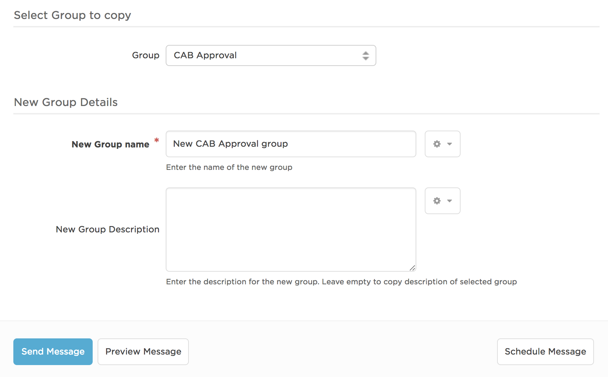

# Copy an xMatters Group
This is a process to copy an xMatters group.  Although creating a new group manually is not rocket science it can be made much **much** easier.

You may have complex Groups populated with on-call members that support specific areas of your business.  You may need to create new groups that use the same shift, rota and on-call members supporting other areas of the business.  Perhaps you could build a group template that includes all standardised shift patterns and use this as a basis for other groups you need.

This 'integration' allows you to select a group from a list and copy it including shifts, rotas, members, devices and escalations.

<kbd>
  
</kbd>

# Pre-Requisites
* xMatters account - If you don't have one, [get one](https://www.xmatters.com)!

# Files
* [CopyGroups.zip](CopyGroups.zip) - This is the communication plan containing all required functionality. (Two forms, two outbound integrations, two shared libraries and one constant)

# How it works
There are two processes:
**Populate Group Property** is used to initially build the Group list.  Run this process first.
**Copy Group** is then used as required to create a copy of an existing group

1. select a group to copy from a list of groups
2. enter a new name for the group
3. optionally enter a description for the new group (if none its provided it uses the description of the template group)
4. send message to create the new group
5. monitor the resulting event.  The event will terminate when the new group has been created.  
6. Any errors are added as comments to the event
7. if there are no errors the new group is automatically added to the group list

Thereafter you can make any small changes you need on the new group :)

# Installation
1. Import the **CopyGroups.zip** communication plan
2. Configure relevant 'Sender Permissions' on each form
3. Copy the 'Property Identifier' (UUID) of the 'Group' Property
4. Paste the Group property identifier into the 'Group Property UUIDs' Constants value

## xMatters set up
It is not necessary to target recipients in either of the forms but you can if you wish.  **Very** basic email message templates have been defined for each form.
'Populate Group Properties' process needs to ran once to populate the group list.  It only needs to ran again if groups have subsequently been created manually.

# Testing
Run **Populate Group Property** process.  Once complete check the Group property in 'Copy Groups' form is populated with your Groups
Run **Copy Group** process.  Once complete, check there are no error comments on the event and the new group has been created.  Check shifts, members and escalations.

# Troubleshooting
If the Group list is not created confirm the correct UUID is in the 'Group Property UUIDs' Constants.
Some errors, such as a duplicated group name result in no group being created.  This is fine.  Some errors may relate to specific shifts in a group.  In this case the group will have been created but you may need to manually recreate the identified shift.  This nature of error will be reported in event comments.
If the new group is not created, and there are no error comments on the event, then check the activity stream for the 'Create New Group' outbound integration.
